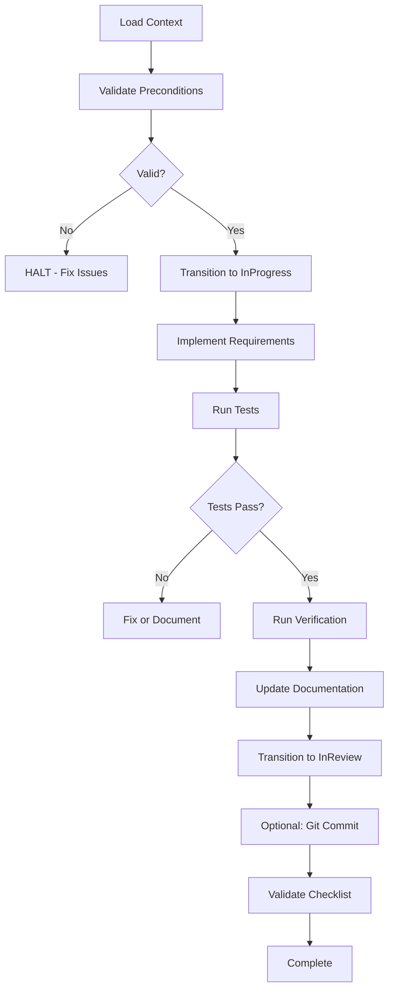

# MyFlow - AI-Native Workflow System

> **Agile task management with AI-powered automation, inspired by BMAD workflows**

---

## 📖 Overview

MyFlow is an **AI-native workflow management system** that combines:
- ✅ **Agile principles** (PBI → Tasks → Incremental delivery)
- ✅ **AI-powered automation** (AI agents execute workflows)
- ✅ **Strict policy compliance** (Enforced rules and validations)
- ✅ **BMAD-inspired workflows** (YAML + XML/Markdown orchestration)

Unlike traditional project management tools, MyFlow is designed to be **read and executed by AI agents** (Claude, GPT, etc.), making task execution intelligent, automated, and policy-compliant.

---

## 🏗️ System Architecture

```
├── config.yaml                          # 🎛️ Central configuration
├── AGENTS.md                            # 🤖 AI agent instructions
│
├── workflows/                           # 📋 AI-executable workflows
│   ├── execute-task.yaml                # Execute task from Agreed to InReview
│   ├── execute-task-instructions.md     # Step-by-step AI guidance
│   └── execute-task-checklist.md        # Validation checklist
│
├── docs/
│   ├── delivery/                        # 📦 Deliverables
│   │   ├── backlog.md                   # Product backlog
│   │   └── {pbi-id}/
│   │       ├── prd.md                   # PBI requirements
│   │       ├── tasks.md                 # Task index
│   │       └── {task-id}.md             # Individual tasks
│   │
│   └── rules/                           # 📚 Project policy
│       ├── project-policy-index.md      # Policy overview
│       └── sections/                    # Detailed policy sections
│
└── scripts/                             # 🔧 Utility scripts
```

---

## 🚀 Quick Start

### For AI Agents (Claude, GPT, etc.)

When a user asks you to execute a MyFlow task:

1. **Read the workflow definition:**
   ```
   myflow/workflows/execute-task.yaml
   ```

2. **Load the instructions:**
   ```
   myflow/workflows/execute-task-instructions.md
   ```

3. **Follow the steps** while respecting critical rules

4. **Validate using checklist:**
   ```
   myflow/workflows/execute-task-checklist.md
   ```

### For Human Users

**To execute a task:**
```
User: Execute task 14-1

AI:
  1. Reads execute-task.yaml
  2. Loads all context (AGENTS.md, policy, PBI, task details)
  3. Validates preconditions
  4. Guides implementation step-by-step
  5. Runs tests and validations
  6. Updates documentation
  7. Transitions task to InReview
```

---

## 🎯 Core Concepts

### Product Backlog Items (PBIs)

**What:** High-level features or requirements

**States:** Proposed → PlanInReview → NeedsPlanRework → ReadyForTasks → InProgress → InReview → Done → Rejected

**Location:** `docs/delivery/{pbi-id}/prd.md`

**Example:**
```markdown
# PBI-14: Tích hợp Trình chỉnh sửa Trực quan Directus

## Overview
Tích hợp Visual Editor của Directus vào trang web...

## User Stories
- US1: Với tư cách là biên tập viên, tôi muốn...

## Acceptance Criteria
- AC1: Hiển thị chỉ báo "edit" bên cạnh nội dung...
```

### Tasks

**What:** Implementable work items broken down from PBIs

**States:** Proposed → Agreed → InProgress → InReview → Testing → Blocked → Done → Cancelled

**Location:** `docs/delivery/{pbi-id}/{task-id}.md`

**Key Sections:**
- **Description:** What needs to be done
- **Requirements:** Detailed specifications
- **Implementation Plan:** Which files to modify
- **Verification:** How to verify completion
- **Status History:** State transitions with timestamps

**Example:**
```markdown
# 14-1 Cấu hình và Khởi tạo Cơ bản

## Description
Cấu hình và khởi tạo thư viện Visual Editor...

## Status History
| Timestamp | Event Type | From | To | Details | User |
|-----------|------------|------|-----|---------|------|
| 2025-10-21T10:30:00Z | State Transition | Agreed | InProgress | Started execution | User |

## Requirements
1. Tạo biến môi trường...
2. Viết module khởi tạo...
```

### Workflows

**What:** AI-executable orchestration scripts

**Types:**
- **execute-task**: Execute task from Agreed to InReview
- **create-pbi**: Create new PBI (future)
- **transition-task**: Change task state (future)
- **generate-tasks**: Break PBI into tasks (future)

**Components:**
1. **workflow.yaml** - Configuration, variables, rules
2. **instructions.md** - Step-by-step AI guidance
3. **checklist.md** - Validation criteria

---

## 📋 Workflows

### Execute Task Workflow

**Purpose:** Execute a task following MyFlow policy

**When to use:**
- Task is in `Agreed` state
- Ready to implement requirements
- Want AI to guide implementation

**How it works:**



**Example usage:**

```
User: Execute task 14-1

AI: I'll execute task 14-1 following the MyFlow workflow.

[AI reads workflow.yaml]
[AI loads context from AGENTS.md, config.yaml, policy, PBI, task file]
[AI validates preconditions]

✅ PRECONDITIONS CHECK
- Task state: Agreed ✓
- Concurrent tasks: 0 ✓
- PBI state: InProgress ✓

[AI follows instructions step-by-step]
[AI implements requirements with suggestions]
[AI runs tests]
[AI updates documentation]
[AI transitions task to InReview]

✅ TASK EXECUTION COMPLETE
Task 14-1 is now InReview and ready for code review.
```

---

## ⚙️ Configuration

### config.yaml

Central configuration file containing:

**Project Settings:**
- Project name, root path
- Team settings (language, skill level)

**Directory Locations:**
- All file paths with variable substitution
- `{project-root}`, `{delivery_folder}`, etc.

**State Definitions:**
- Valid PBI states and transitions
- Valid task states and transitions

**Automation Settings:**
- Auto-update backlog/task index
- Strict mode enforcement
- Git commit preferences

**Policy Rules:**
- `max_concurrent: 1` (one task at a time)
- State validation rules
- Testing requirements

**Example:**
```yaml
project:
  name: "BMAD-METHOD-6-alpha"

locations:
  delivery_folder: "{project-root}/myflow/docs/delivery"

task:
  max_concurrent: 1
  states: ["Proposed", "Agreed", "InProgress", "InReview", "Testing", "Done"]

automation:
  strict_mode: true
  auto_update_backlog: true
```

---

## 📚 Documentation

### AGENTS.md

**Purpose:** Primary directive for AI agents

**Contains:**
- Your role and responsibilities
- Critical rules (NEVER violate)
- Workflow overview
- Common mistakes to avoid
- Quick start checklist

**AI agents MUST read this first**

### Project Policy

**Location:** `docs/rules/`

**Structure:**
```
project-policy-index.md          # Main entry point
sections/
  ├── 1-fundamentals.md           # Core principles
  ├── 2-pbi-management.md         # PBI workflows
  ├── 3-task-management.md        # Task workflows
  ├── 4-testing-strategy.md       # Testing guidelines
  └── 5-quick-reference.md        # Checklists & patterns
```

**Key Principles:**
- Task-driven development
- DRY (Don't Repeat Yourself)
- Legacy code prioritization
- Hierarchical planning
- PRD alignment

---

## 🔧 How AI Agents Execute Workflows

### Step 1: Read Workflow Definition

```yaml
# AI reads: myflow/workflows/execute-task.yaml

name: execute-task
critical_rules:
  - "Task MUST be in 'Agreed' state"
  - "ALWAYS check max_concurrent: 1 rule"
  - "Preserve document structure"

recommended_inputs:
  - "myflow/AGENTS.md"
  - "myflow/config.yaml"
  - "{task_path}"
  - "docs/delivery/{pbi_id}/prd.md"

instructions_file: "execute-task-instructions.md"
```

### Step 2: Load Context

AI automatically loads:
1. ✅ AGENTS.md (primary directive)
2. ✅ config.yaml (configuration)
3. ✅ Project policy (rules)
4. ✅ Task file (requirements)
5. ✅ Parent PBI (context)
6. ✅ Task index (concurrent check)

### Step 3: Follow Instructions

AI reads `execute-task-instructions.md` and follows steps:

1. **Validate Preconditions**
   - Check task state
   - Check concurrent tasks
   - Validate PBI state

2. **Transition to InProgress**
   - Update Status History table
   - Update task index

3. **Implement Requirements**
   - AI suggests approaches
   - Implement code
   - Write tests

4. **Run Tests & Verification**
   - Execute test suite
   - Run verification steps

5. **Update Documentation**
   - Append implementation notes
   - Document changes

6. **Transition to InReview**
   - Update state
   - Log history

7. **Optional Git Commit**
   - Stage files
   - Create commit

8. **Validate Checklist**
   - Run validation
   - Report results

### Step 4: Report Completion

AI provides comprehensive summary:
- Files modified
- Tests results
- State transitions
- Next steps

---

## 🎓 Examples

### Example 1: Simple Task Execution

```
User: Execute task 14-1

AI:
  ✓ Loaded context (5 files)
  ✓ Validated preconditions
  ✓ Transitioned to InProgress
  ✓ Implemented 4 requirements
  ✓ Tests passing (12 unit, 2 integration)
  ✓ All verifications passed
  ✓ Documentation updated
  ✓ Transitioned to InReview

  ✅ Task 14-1 complete - ready for review
```

### Example 2: Handling Precondition Failure

```
User: Execute task 14-2

AI:
  ✓ Loaded context

  ❌ PRECONDITION FAILURE

  Task 14-1 is currently InProgress.

  Policy: max_concurrent: 1 (only 1 task at a time)

  Please complete or cancel task 14-1 before starting 14-2.

  HALT: Cannot proceed.
```

### Example 3: Test Failure Handling

```
User: Execute task 14-3

AI:
  ✓ Implemented requirements
  ✓ Tests written

  ❌ TEST FAILURE

  2 tests failed:
  - useVisualEditor should return false when disabled
  - initVisualEditor should not load script when disabled

  Strict mode is enabled.

  Options:
  1. Fix implementation
  2. Fix tests
  3. Continue anyway (not recommended)

  → Your choice?
```

---

## 🛠️ Advanced Usage

### Customizing Workflows

You can create custom workflows by:

1. **Copy existing workflow:**
   ```bash
   cp workflows/execute-task.yaml workflows/my-workflow.yaml
   ```

2. **Modify configuration:**
   ```yaml
   name: my-workflow
   description: "Custom workflow for..."
   critical_rules:
     - "Your custom rules..."
   ```

3. **Update instructions:**
   Create `my-workflow-instructions.md` with your steps

4. **Tell AI to use it:**
   ```
   User: Execute my custom workflow for task 14-4

   AI: [Reads my-workflow.yaml and follows instructions]
   ```

### Adding New File Inputs

Update workflow.yaml:
```yaml
recommended_inputs:
  supporting_docs:
    - path: "myflow/docs/my-custom-doc.md"
      purpose: "Additional context"
      when: "if_needed"
```

### Customizing Validation

Update checklist.md:
```markdown
### My Custom Checks ✓

- [ ] Custom requirement 1
- [ ] Custom requirement 2
```

---

## 🚨 Troubleshooting

### AI Not Following Workflow

**Problem:** AI doesn't read workflow files

**Solution:**
```
User: Please read myflow/workflows/execute-task.yaml
      and follow the workflow to execute task 14-1
```

### Precondition Failures

**Problem:** Task in wrong state

**Solution:** Transition task to Agreed first
```
User: Please transition task 14-1 from Proposed to Agreed
```

**Problem:** Concurrent tasks

**Solution:** Complete or cancel active task
```
User: Mark task 14-1 as Done
```

### Test Failures

**Problem:** Tests fail in strict mode

**Solution:** Fix tests or disable strict mode
```yaml
# In config.yaml
automation:
  strict_mode: false  # Temporarily allow test failures
```

---

## 📖 Related Documentation

- **[AGENTS.md](./AGENTS.md)** - Primary AI agent instructions
- **[config.yaml](./config.yaml)** - Central configuration
- **[Project Policy Index](./docs/rules/project-policy-index.md)** - Complete policy documentation
- **[Task Management Rules](./docs/rules/sections/3-task-management.md)** - Task workflow details
- **[Testing Strategy](./docs/rules/sections/4-testing-strategy.md)** - Testing guidelines

---

## 🤝 Contributing

### Adding New Workflows

1. Create workflow.yaml
2. Write instructions.md
3. Create checklist.md (optional)
4. Test with AI agent
5. Document in this README

### Improving Existing Workflows

1. Update workflow.yaml or instructions.md
2. Test changes with AI
3. Update version number
4. Document changes

---

## 📝 Version History

| Version | Date | Changes |
|---------|------|---------|
| 1.0 | 2025-10-21 | Initial AI-native workflow system with execute-task workflow |

---

## 🎯 Future Enhancements

Planned workflows:
- [ ] **create-pbi.yaml** - Create new PBI with AI assistance
- [ ] **generate-tasks.yaml** - Break PBI into tasks
- [ ] **transition-task.yaml** - Change task state safely
- [ ] **transition-pbi.yaml** - Change PBI state
- [ ] **review-task.yaml** - Code review workflow
- [ ] **merge-task.yaml** - Merge completed task

Planned features:
- [ ] Web-based workflow executor
- [ ] Workflow analytics and metrics
- [ ] Custom workflow templates
- [ ] Multi-agent orchestration

---

## 💡 Philosophy

MyFlow believes in:

1. **AI as Collaborator** - AI agents are intelligent partners, not dumb scripts
2. **Human-AI Harmony** - Workflows designed for AI to read, humans to understand
3. **Policy as Code** - Rules enforced automatically, not manually
4. **Quality by Design** - Validation built into every step
5. **Continuous Improvement** - Workflows evolve based on experience

---

## 🙏 Credits

Inspired by:
- **BMAD** - Workflow orchestration patterns
- **Agile/Scrum** - Iterative development principles
- **AI-Native Development** - Building for AI-first workflows

---

**Happy task execution! 🚀**

---

## 📞 Support

For questions or issues:
1. Check the documentation in `docs/rules/`
2. Review workflow instructions in `workflows/`
3. Ask your AI agent to explain

---

**Last Updated:** 2025-10-21
**Version:** 1.0
**Maintained by:** MyFlow Team
